# LAB5_JAVASCRIPT
## PEMOGRAMAN WEB
## TEKNIK INFORMATIKA
## UNIVERSITAS PELITA BANGSA
##
## HIDAYAT TULLOH
## 312110110
## TI.21.B1

## Langkah-Langkah Praktikum
<b>Membuat Dokumen HTML Pengenalan Javascript<b>
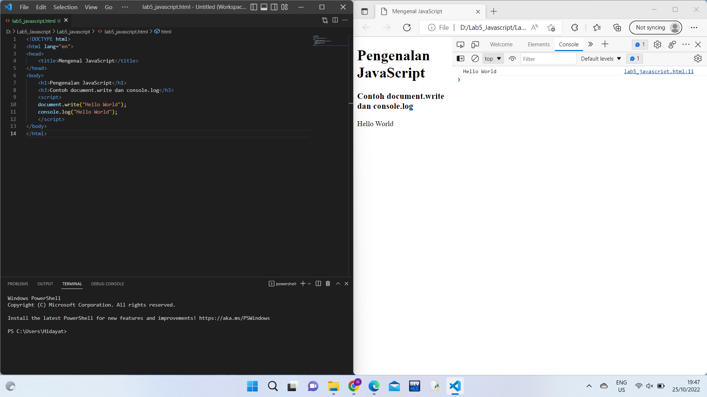
1. Pemakaian Alert
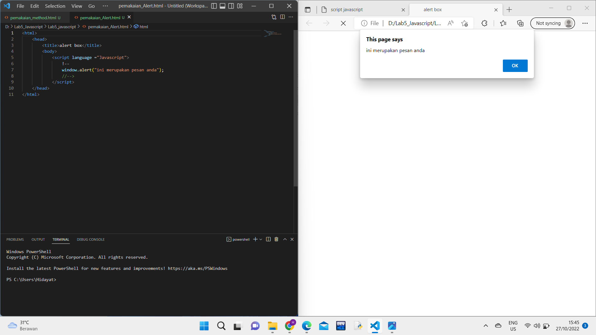
2. Pemakaian Method
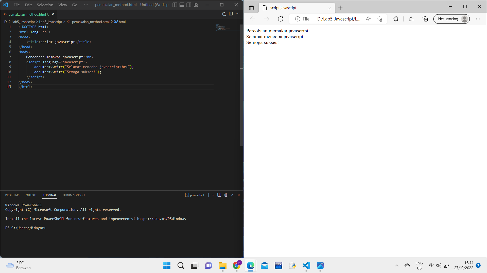
3. Pemakaian Prompt
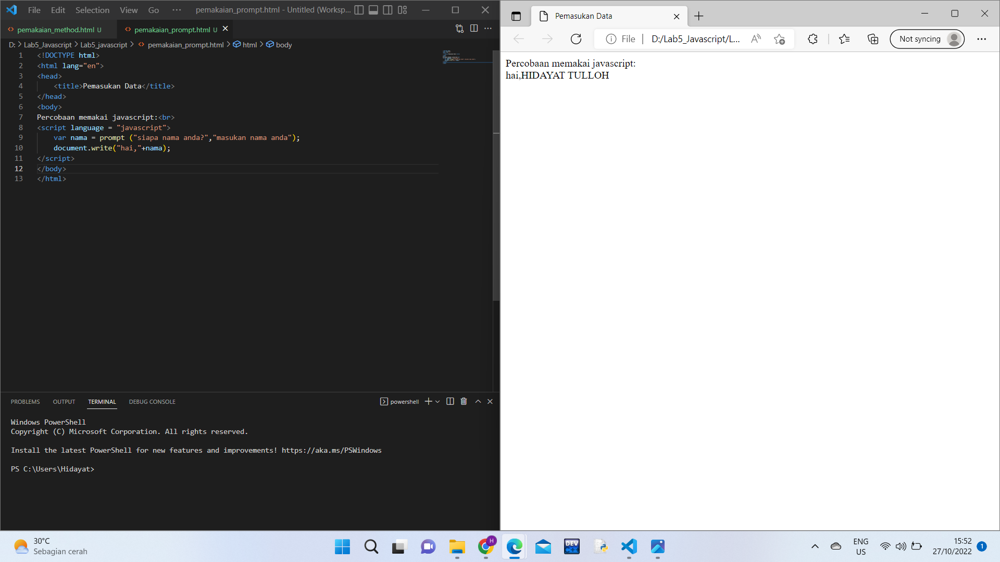
4. Pembuatan Fungsi Dan Cara Pemanggilannya
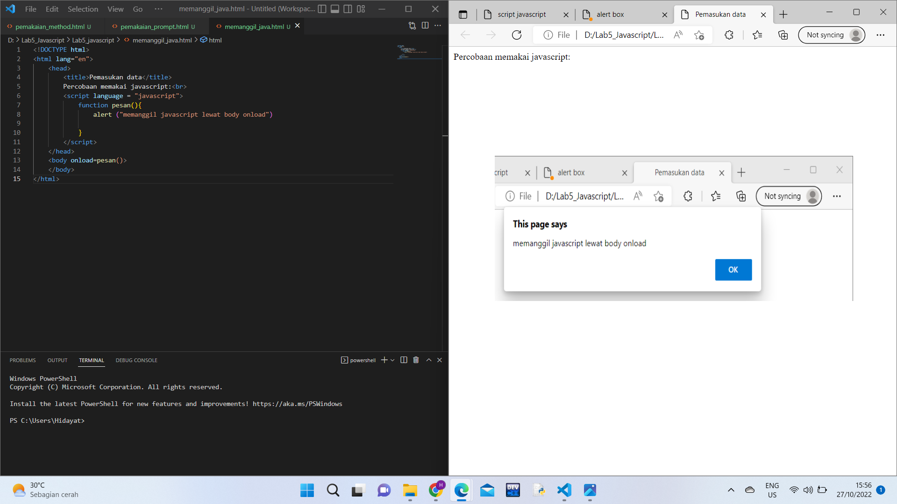
5. Oprasi dasar aritmatika
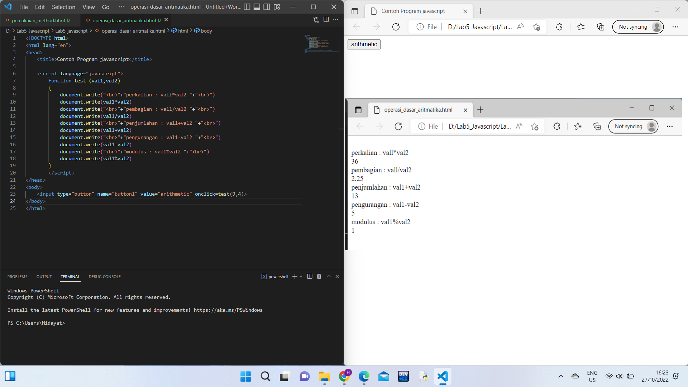
6. seleksi kondisi (if.else)
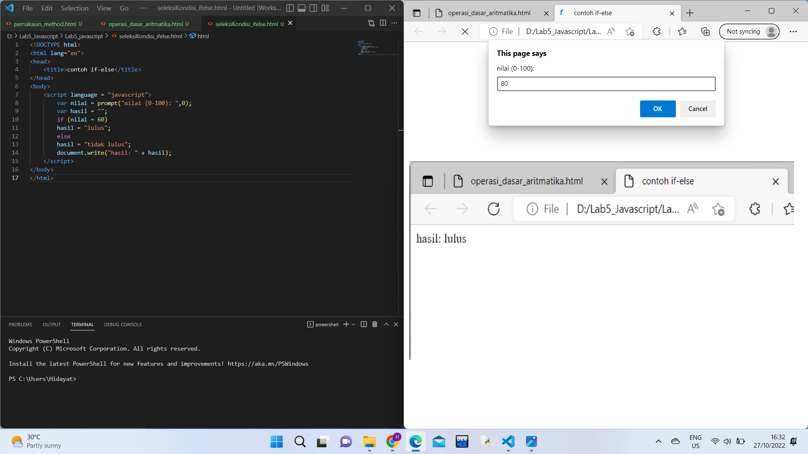
7. Penggunaan Oprator switch untuk seleksi kondisi
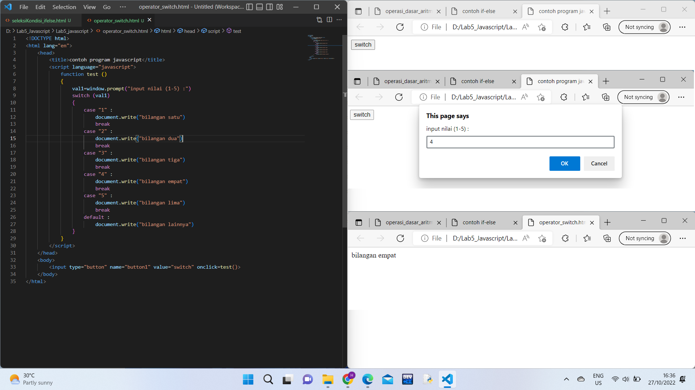
8. Pembuatan Form Input
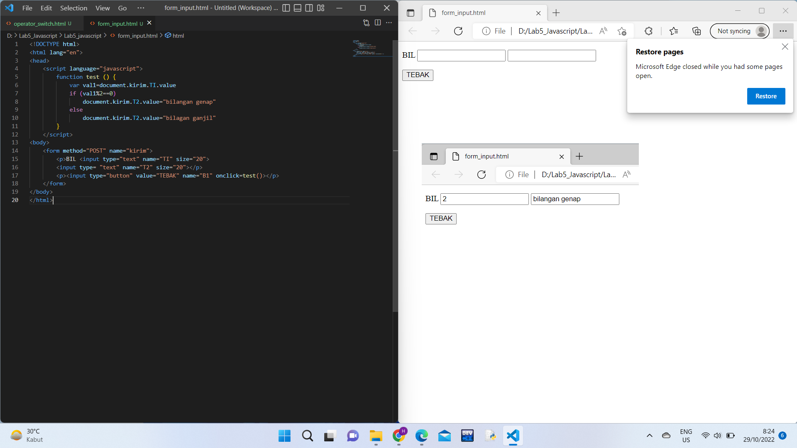
9. Pembuatan Form Button
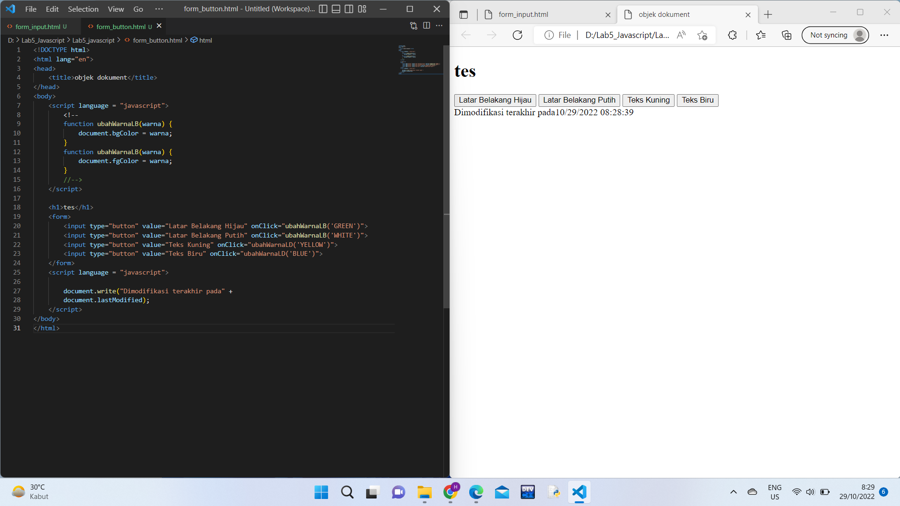
10. HTML DOM
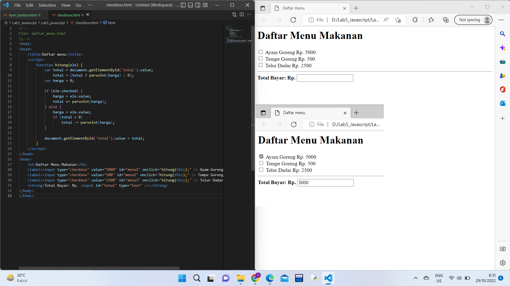
# Pertanyaan dan Tugas
1. Buat script untuk melakukan validasi pada isian form
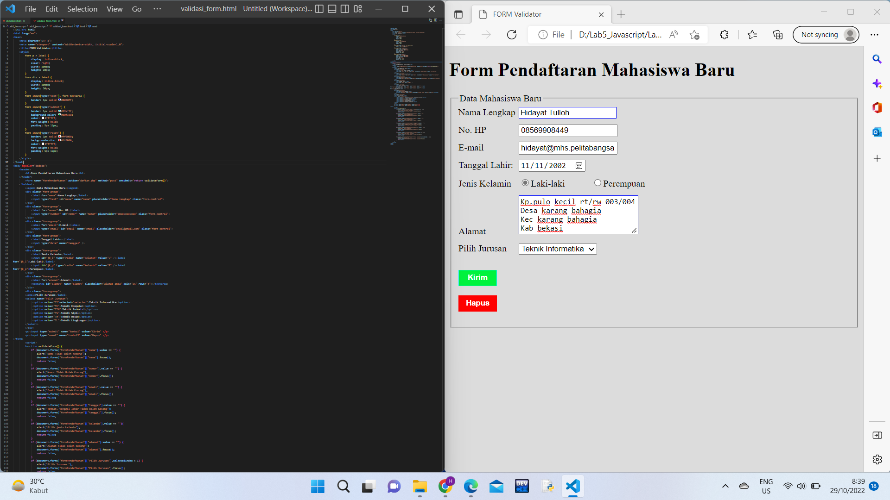
# TERIMAKASI# Lab5_javascript